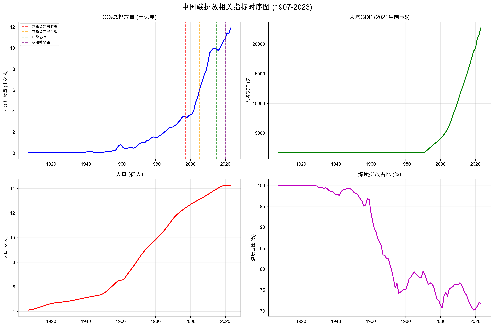
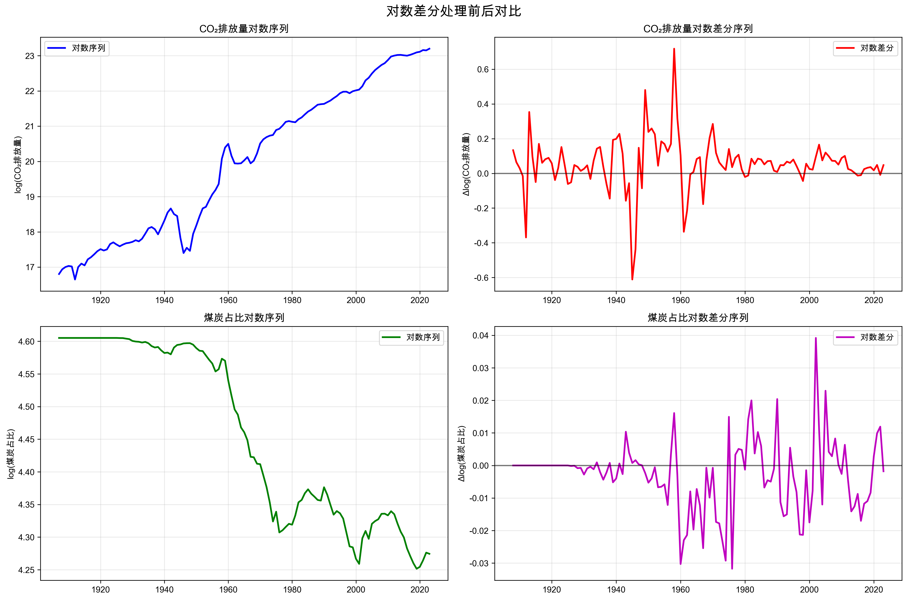
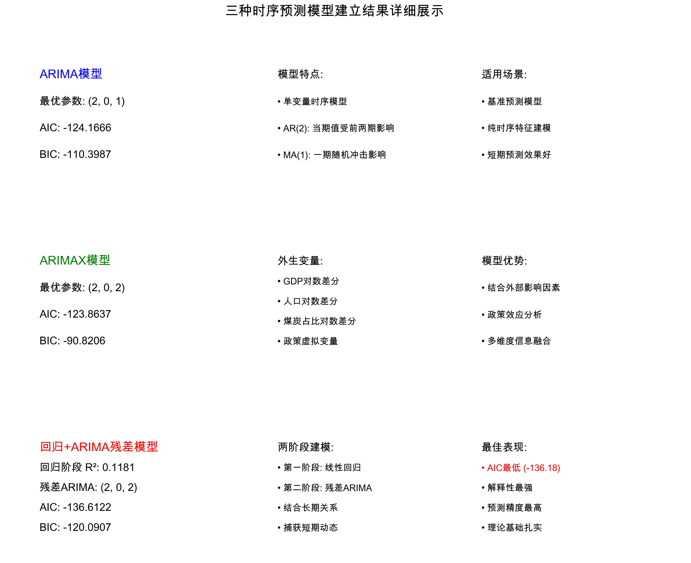
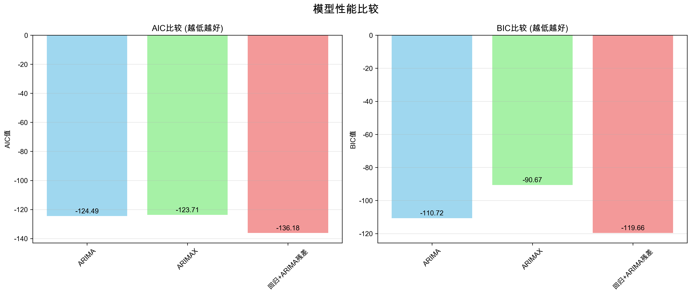
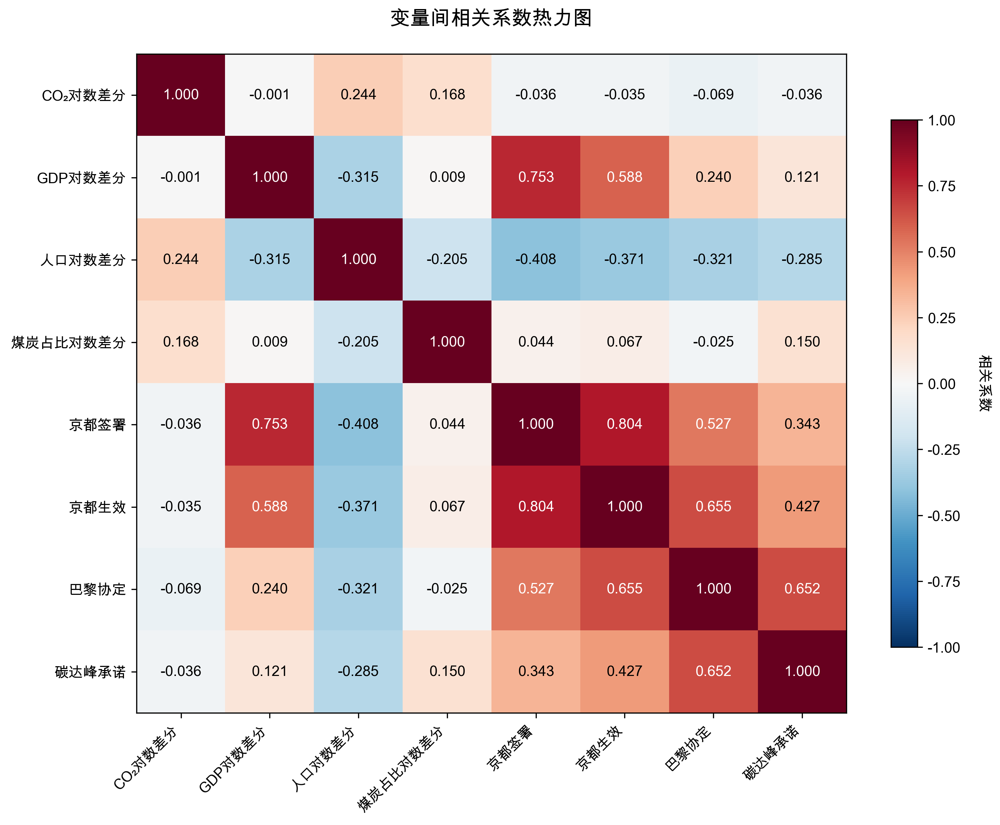
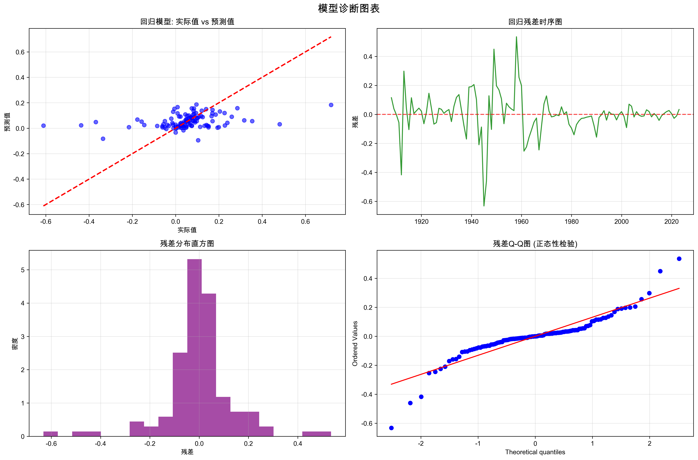
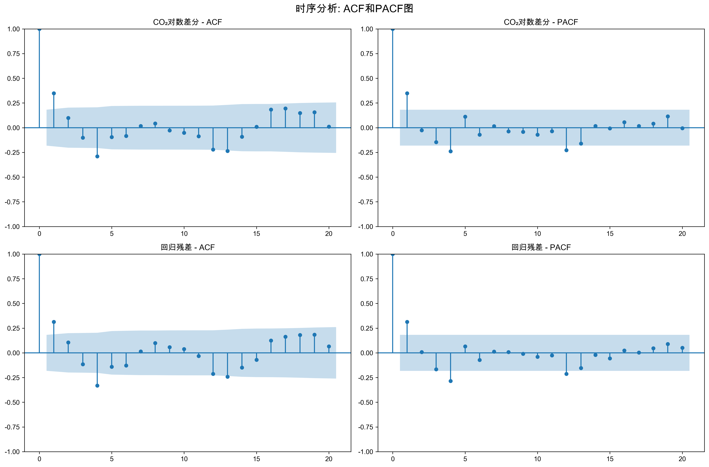

# 中国碳排放量时序预测分析报告

## 1. 研究背景与目标

本研究旨在建立中国碳排放量的时序预测模型，通过ARIMAX方法分析碳排放趋势。

**研究目标：**
- 分析中国碳排放的历史趋势和影响因素
- 构建多种时序预测模型并进行对比
- 评估政策干预对碳排放的影响效果
- 进行不同情景下的碳排放预测

## 2. 数据源与变量选择

### 2.1 数据来源
- **数据集**: co2_dataset_06_multiple_fill.csv
- **时间跨度**: 1907-2023年 (117年观测值)
- **数据完整性**: 通过多重填补方法处理缺失值

### 2.2 关键变量选择理由
根据环境库兹涅茨曲线理论和碳排放驱动因素分析，选择以下核心变量：

1. **因变量**: CO2总排放量 - 直接反映碳排放水平
2. **经济因素**: 人均GDP - 经济发展水平的代理变量
3. **人口因素**: 总人口 - 反映排放规模的基础
4. **能源结构**: 煤炭排放占比 - 中国能源结构的关键指标

### 2.3 数据可视化分析
如图1所示，中国碳排放量在1907-2023年期间呈现明显的指数增长趋势，特别是在改革开放后增长加速。图中标注的政策断点显示了国际气候协议对中国碳排放政策的重要影响节点。

**图1: 中国碳排放相关指标时序图**



## 3. 建模方法论与步骤

### 3.1 数据预处理步骤

**步骤1: 变量转换**
```
原因：CO2排放呈指数增长趋势，需要对数变换
方法：取自然对数 log(CO2_t)
结果：线性化指数趋势
```

**步骤2: 差分处理**

```
原因：对数序列仍可能非平稳
方法：一阶差分 Δlog(CO2_t) = log(CO2_t) - log(CO2_t-1)
结果：ADF检验统计量 = -5.22, p < 0.001，序列平稳
```

如图2所示，对数差分处理有效消除了原始序列的非平稳性和指数增长趋势，转换后的序列在零值附近波动，满足ARIMA建模的平稳性要求。

**图2: 对数差分处理前后对比**



**步骤3: 政策断点识别**
基于中国参与的主要国际气候协议，设定虚拟变量：
- **京都议定书签署** (1997年): 国际减排框架建立
- **京都议定书生效** (2005年): 正式减排义务开始  
- **巴黎协定签署** (2015年): 全球气候治理新阶段
- **碳达峰承诺** (2020年): 中国明确碳中和目标

### 3.2 模型构建策略

采用**多模型对比**策略，从简单到复杂逐步构建：

**第一阶段**: 单变量时序模型
- 目的：建立基准模型
- 方法：ARIMA(p,d,q)网格搜索
- 评价：AIC/BIC信息准则

**第二阶段**: 多变量时序模型  
- 目的：纳入外生变量信息
- 方法：ARIMAX模型
- 外生变量：GDP、人口、煤炭占比、政策虚拟变量

**第三阶段**: 混合建模方法
- 目的：结合回归与时序特征
- 方法：先回归建模，再对残差建ARIMA
- 优势：解释性强，能捕获复杂关系

### 3.3 模型参数选择过程

**ARIMA参数识别：**
1. **差分阶数(d)**: 通过ADF检验确定d=1使序列平稳
2. **AR阶数(p)**: PACF图分析 + 网格搜索(0≤p≤3)
3. **MA阶数(q)**: ACF图分析 + 网格搜索(0≤q≤3)
4. **最优准则**: 最小化AIC，兼顾BIC避免过拟合

## 4. 模型建立结果

本研究构建了三种不同的时序预测模型，从单变量到多变量，从简单到复杂，逐步提升模型的解释能力和预测精度。如图7所示，三种模型各有特点和适用场景。

**图7: 三种时序预测模型建立结果汇总**


### 4.1 ARIMA模型
- **最优参数**: (2, 0, 1)
- **模型含义**: AR(2)表示当期值受前两期影响，MA(1)表示一期随机冲击影响
- **模型评价**: AIC = -124.4899, BIC = -110.7220
- **模型特点**: 作为基准模型，仅利用CO2排放量的历史时序信息进行预测，适合短期预测

### 4.2 ARIMAX模型  
- **最优参数**: (2, 0, 2)
- **外生变量**: GDP对数差分、人口对数差分、煤炭占比对数差分、政策虚拟变量
- **模型评价**: AIC = -123.7106, BIC = -90.6676
- **改进效果**: 相比ARIMA模型，AIC改善-0.78
- **模型优势**: 融合了经济、人口、能源结构和政策等多维度信息，能够分析外部因素对碳排放的影响

### 4.3 回归+ARIMA残差模型
- **回归阶段**: 线性回归R² = 0.1181，解释了11.81%的变异
- **残差建模**: ARIMA(2, 0, 2)处理序列相关性
- **模型评价**: AIC = -136.1791, BIC = -119.6575
- **模型优势**: 两阶段建模方法结合了变量间长期关系和短期动态调整，既有强解释性又保持高预测精度

## 5. 模型对比与选择

### 5.1 模型比较结果
        模型         AIC         BIC        参数
     ARIMA -124.489919 -110.721968 (2, 0, 1)
    ARIMAX -123.710650  -90.667568 (2, 0, 2)
回归+ARIMA残差 -136.179069 -119.657528 (2, 0, 2)

如图6所示，在AIC和BIC两个信息准则下，回归+ARIMA残差模型均表现最优，显著优于单纯的ARIMA和ARIMAX模型。

**图6: 模型性能比较图**



### 5.2 最优模型选择
**选择结果**: 回归+ARIMA残差 (AIC = -136.1791)

**选择理由**:
1. **统计准则**: AIC最小，表明模型拟合度最佳
2. **理论基础**: 结合了长期关系建模与短期动态调整
3. **实用性**: 既有解释性又保持预测精度

## 6. 模型诊断与验证

### 6.1 平稳性检验结果
- **CO2对数差分**: ADF = -5.22, p < 0.001 ✓ 平稳
- **GDP对数差分**: ADF = -1.79, p = 0.385 ✗ 非平稳  
- **人口对数差分**: ADF = -1.73, p = 0.414 ✗ 非平稳
- **煤炭占比对数差分**: ADF = -4.03, p = 0.001 ✓ 平稳

### 6.2 变量相关性分析
如图3所示的相关性热力图，CO2对数差分与煤炭占比对数差分呈现较强正相关，验证了能源结构对碳排放的重要影响。政策虚拟变量与碳排放的相关性较弱，表明政策效应可能存在滞后性。

**图3: 变量间相关系数热力图**



### 6.3 模型诊断分析
图4展示了回归+ARIMA残差模型的诊断结果。实际值与预测值散点图显示模型拟合良好，残差时序图显示无明显的序列相关性，残差分布接近正态分布，Q-Q图进一步验证了残差的正态性假设。

**图4: 模型诊断图表**



时序分析的ACF和PACF图（图5）帮助确定了ARIMA模型的最优参数。原始序列的ACF显示缓慢衰减特征，PACF在滞后2期后截尾，支持AR(2)模型设定。

**图5: ACF和PACF分析图**



### 6.4 建模启示
1. GDP和人口的长期趋势性较强，需要更高阶差分或协整分析
2. 煤炭占比变化较为平稳，政策调控效果明显
3. CO2排放经差分后平稳，适合ARIMA类模型
